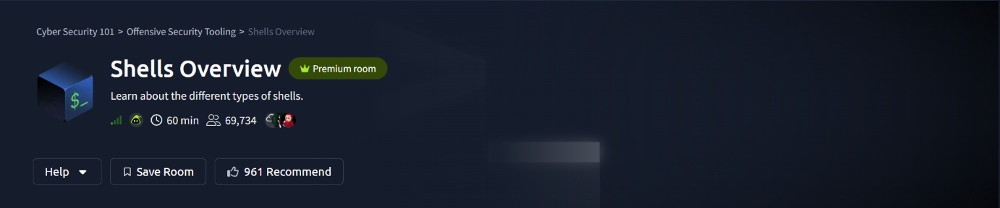
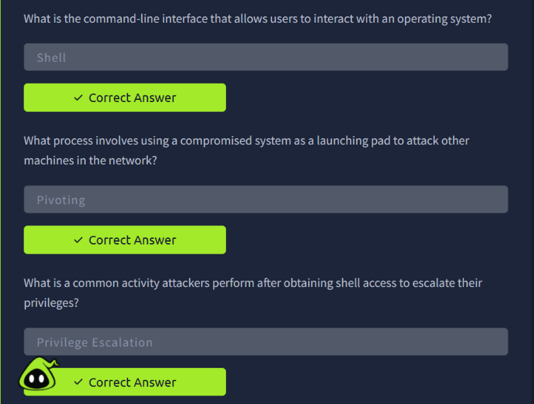
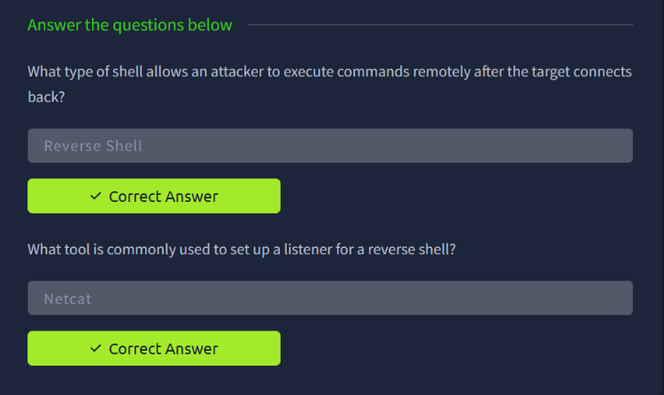
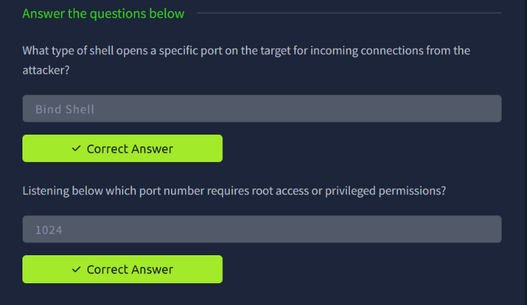
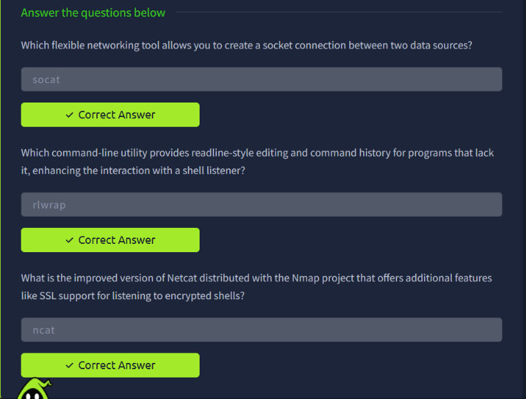
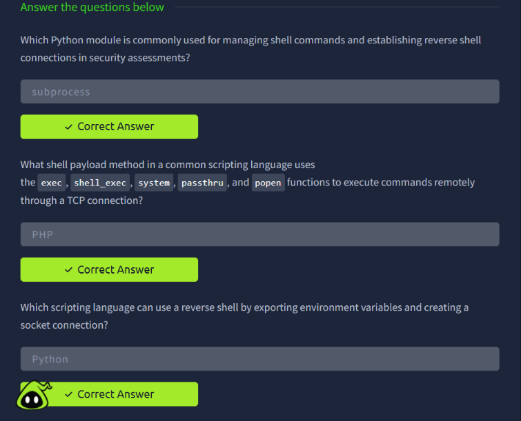
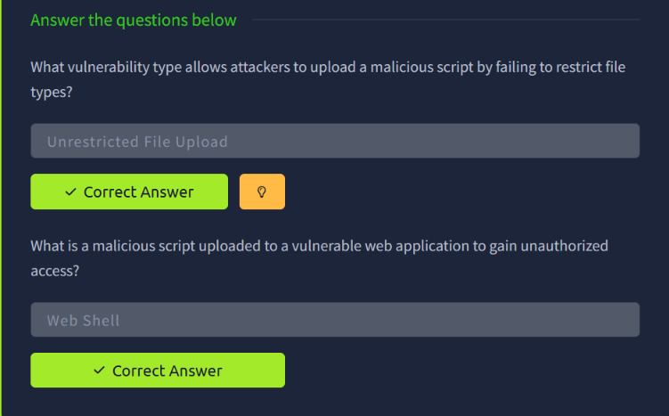
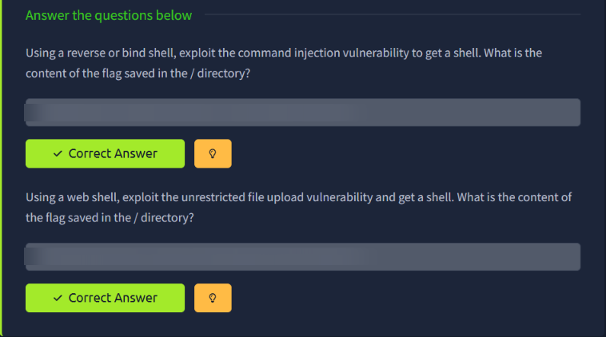

# TryHackMe — Shells Overview

> **Track:** Cyber Security 101 → Offensive Security Tooling
> **Difficulty:** Easy · **Time:** ~60 min
> **Focus:** Shell types, listeners, scripting-language payloads, and getting shells via real vulnerabilities (command injection + unrestricted file upload)



A shell is the end goal of most exploitation chains: once you have one, you have interactive command execution on the target. This room covers the vocabulary and tooling around shells — reverse, bind, web — and then puts that into practice against two classic vulnerabilities.

---

## Table of Contents
1. [Shell Fundamentals](#1-shell-fundamentals)
2. [Reverse Shells](#2-reverse-shells)
3. [Bind Shells](#3-bind-shells)
4. [Supporting Tools: socat, rlwrap, ncat](#4-supporting-tools-socat-rlwrap-ncat)
5. [Scripting-Language Payloads](#5-scripting-language-payloads)
6. [Web Shells](#6-web-shells)
7. [Hands-On: Getting Shells from Real Vulnerabilities](#7-hands-on-getting-shells-from-real-vulnerabilities)
8. [Key Takeaways](#8-key-takeaways)

---

## 1. Shell Fundamentals

Core vocabulary before diving into shell types:

- **Shell**: the command-line interface that lets a user interact with an operating system.
- **Pivoting**: using a compromised system as a launching pad to attack other machines in the network.
- **Privilege escalation**: a common activity after obtaining shell access — escalating from whatever access the initial shell grants up to higher privileges.



---

## 2. Reverse Shells

A **reverse shell** lets an attacker execute commands remotely *after the target connects back* to the attacker's listener — the target initiates the outbound connection, which is useful for getting past inbound firewall restrictions.

The classic tool for standing up the listener side is **Netcat**:

```bash
nc -lvnp <port>
```



---

## 3. Bind Shells

The inverse of a reverse shell: a **bind shell** opens a specific port *on the target* and waits for the attacker to connect in. This requires the target to be directly reachable, which is often blocked by firewalls or NAT — one reason reverse shells are more commonly favoured in practice.

One operational detail worth remembering: on Linux, binding to a listening port **below 1024** requires root access or privileged permissions, since ports 0–1023 are reserved "well-known" ports.



---

## 4. Supporting Tools: socat, rlwrap, ncat

Three tools that make shell handling smoother in practice:

| Tool | Purpose |
|---|---|
| **socat** | A flexible networking tool that creates a socket connection between two data sources — more capable than Netcat for things like fully interactive TTYs and encrypted channels |
| **rlwrap** | Wraps a program to add readline-style editing and command history to tools (like a raw shell listener) that lack it natively |
| **ncat** | Nmap project's improved version of Netcat, adding features such as SSL support for listening to encrypted shells |



---

## 5. Scripting-Language Payloads

Shells aren't limited to compiled binaries — scripting languages can spawn them too:

- **Python's `subprocess` module** is commonly used for managing shell commands and establishing reverse shell connections in security assessments.
- **PHP** is the scripting language behind the well-known shell payload pattern using `exec`, `shell_exec`, `system`, `passthru`, and `popen` to execute commands remotely through a TCP connection — exactly the functions you'll see in classic PHP webshells.
- **Python** can also pull off a reverse shell by exporting environment variables and creating a raw socket connection directly (no external binary needed).



---

## 6. Web Shells

- **Unrestricted file upload** is the vulnerability class that allows attackers to upload a malicious script because the application fails to restrict file types on upload.
- A **web shell** is the malicious script itself — uploaded to a vulnerable web application to gain unauthorized command access through it, typically reachable afterward via a simple HTTP request to the uploaded file.



---

## 7. Hands-On: Getting Shells from Real Vulnerabilities

The practical ties everything together across two separate exploitation paths against the same target:

**Path 1 — Command injection → reverse/bind shell**
Using a reverse or bind shell, the command injection vulnerability on the target is exploited to get command execution, and from there a full shell. The flag is read from a file saved in the `/` directory once shell access is confirmed.

**Path 2 — Unrestricted file upload → web shell**
The file upload vulnerability is exploited by uploading a web shell (built on the PHP payload pattern from Section 5), then invoking it over HTTP to get command execution. The flag is again read from the `/` directory.



> Both flags redacted — the techniques (command injection → shell, and file upload → web shell) are what matter here, not the literal flag values.

---

## 8. Key Takeaways

- **Reverse vs bind** comes down to who connects to whom — reverse shells dial out (better against inbound firewalls), bind shells wait for an inbound connection.
- **Netcat/ncat/socat** are the standard listener toolkit; **rlwrap** turns a raw shell into something usable for real work.
- **Scripting-language payloads matter** because they let you get a shell from whatever interpreter is already running on the target — no need to drop a compiled binary.
- **Unrestricted file upload is a direct path to remote code execution** the moment the uploaded file can be requested and executed by the server.
- The same target can often be compromised through more than one vulnerability — this room's final task proves that by chaining two completely different bugs to the same outcome: a shell, and a flag in `/`.

---

*Room completed on 3 October 2026 as part of the Cyber Security 101 path.*
